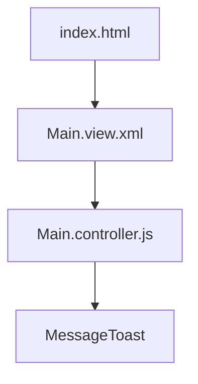

# Minimal OpenUI5 App

A quick guide to building and understanding a minimal OpenUI5 app with XML view, JS controller, and CDN bootstrap.

---

# What is OpenUI5?

- Open-source UI framework by SAP
- Fiori-styled, responsive, enterprise-ready
- Uses MVC (Model-View-Controller) pattern
- Can be loaded via CDN, no build step required

---

# Project Structure

```text
project/
├── index.html
├── view/
│   └── Main.view.xml
└── controller/
    └── Main.controller.js
```

- **index.html**: Entry point, loads OpenUI5 from CDN
- **view/Main.view.xml**: XML view with UI controls
- **controller/Main.controller.js**: JS logic for the view

---

# index.html: The Bootstrapper

```html {5-12}
<!DOCTYPE html>
<html>
<head>
  <meta charset="utf-8">
  <title>Minimal OpenUI5 App</title>
  <script
    id="sap-ui-bootstrap"
    src="https://sdk.openui5.org/resources/sap-ui-core.js"
    data-sap-ui-theme="sap_fiori_3"
    data-sap-ui-libs="sap.m"
    data-sap-ui-resourceroots='{"app": "./"}'>
  </script>
</head>
<body class="sapUiBody" id="content">
  <script>
    sap.ui.getCore().attachInit(function () {
      sap.ui.xmlview({
        viewName: "app.view.Main"
      }).placeAt("content");
    });
  </script>
</body>
</html>
```

::notes::
- Loads OpenUI5 from CDN
- Sets up theme, libraries, and resource roots
- Bootstraps the XML view and places it in the body
::

---

# Main.view.xml: The View

```xml
<mvc:View
  xmlns:mvc="sap.ui.core.mvc"
  xmlns="sap.m"
  controllerName="app.controller.Main">
  <Button text="Click me" press=".onPress" />
</mvc:View>
```

- Declares a button with a `press` event
- Binds to the controller's `onPress` method

---

# Main.controller.js: The Controller

```js
sap.ui.define([
  "sap/ui/core/mvc/Controller",
  "sap/m/MessageToast"
], function(Controller, MessageToast) {
  "use strict";
  return Controller.extend("app.controller.Main", {
    onPress: function() {
      MessageToast.show("Button was pressed!");
    }
  });
});
```

- Handles button press event
- Shows a Fiori-style message toast

---

# How It Works

1. **index.html** loads OpenUI5 and bootstraps the view
2. **Main.view.xml** defines the UI and binds events
3. **Main.controller.js** implements event logic



::notes::
- The flow is: HTML → XML View → Controller → UI5 Controls
::

---

# Running the App

- Serve the `project` folder with any static server:

```sh
npx serve ./project
```

- Open the provided URL in your browser
- Click the button to see the MessageToast

---

# Key Takeaways

- OpenUI5 apps can be built with just static files
- XML views separate UI from logic
- Controllers handle user interaction
- CDN bootstrap means no build step

---

# Resources

- [OpenUI5 Documentation](https://openui5.org/)
- [Slidev Syntax Guide](https://sli.dev/guide/syntax)
- [This Project's Source](./)

<PoweredBySlidev mt-10 /> 