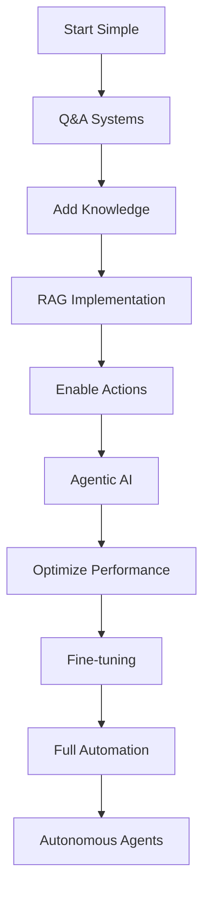
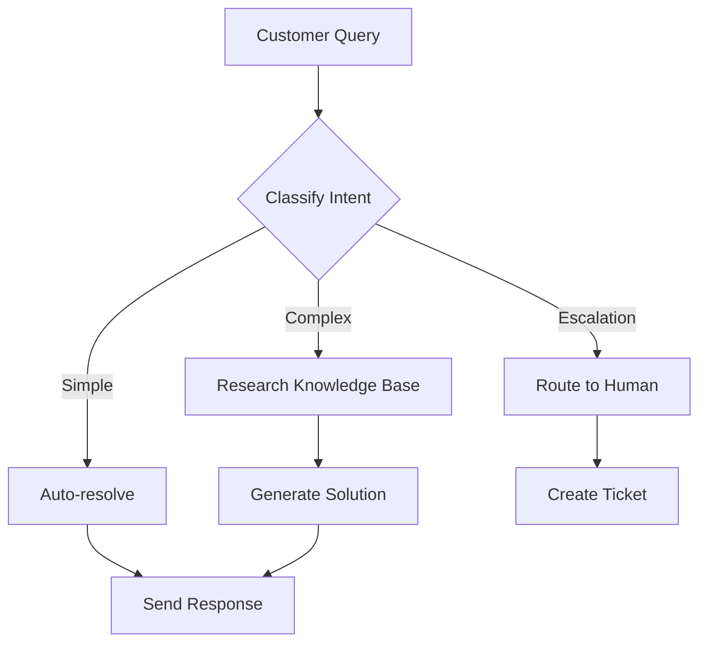

Before:

- [ ] Check all ports/demo/playgrounds are up and running
- [ ] Review and use better markdown elements as per slidev(do not over-engineer though)
- [ ] When possible(and if remembered), ask questions to make it more engaging. Like, Any users for * here?
- [x] ~Better word instead of *marketer* and update~

---

Background:
Before moving on to next point, ask questions.
Before each point, explain what the active point lacks, and how the new point addresses that gap.


Glossary:
- The terms LLM and AI are used interchangeably. The only take away is, it meant a system that can think.

---

TODO:
- [ ] propel theme: colors
- [ ] consistent headings
- [ ] Placement of "check system-prompt leaks"
- [ ] cover insights/notes for MCP use-case
- [x] Links to MCP Servers
  - https://mcp.so/server/puppeteer-plus-martech-mcp/moonbirdai
  - https://www.dextermcp.net/marketplace/
  - https://mcp.composio.dev/
  - https://github.com/modelcontextprotocol/servers
- [x] Limitations of MCP Servers
- [ ] Figma use-case in @Lakshmi system
- [ ] Leave notes sectin for developers
---


----
----

# Bin:


<div>

```typescript
// MCP Resource Example
const mcpConfig = {
  resources: ["database", "api_endpoints"],
  tools: ["email_sender", "calendar_api"],
  prompts: ["task_scheduler", "decision_maker"],
  context: "user_preferences"
}
```
</div>

---
---


---
layout: two-cols
---

# **Key Takeaways**

We've explored four powerful AI implementation patterns:

<div class="grid grid-cols-1 gap-4">

### **🤖 Q&A Systems**
Direct, structured interactions for specific tasks

### **🔍 RAG** 
Knowledge-enhanced responses from your data

### **🧠 Agentic AI**
Autonomous decision-making with system access

### **🎯 Fine-tuning**
Domain-specific expertise and accuracy

</div>

**Remember:** Choose the right pattern for your specific use case and requirements.

::right::

# **Implementation Strategy**



<div class="pt-4">

**Progressive Enhancement:**
- Start with basic Q&A
- Add knowledge bases (RAG)
- Enable system actions (Agentic)
- Optimize with custom training
- Scale to full automation

</div>

---
---


<!-- 
# layout: default
### **4.1 Workflow Automation Platforms:**

<div class="grid grid-cols-3 gap-2">

<div class="p-2 border rounded">

<u>**LangChain**</u>
#### AI Application Framework
- Chain complex AI operations
- Memory management
- Tool integration
- Python/JavaScript support
```python
# LangChain agent
from langchain.agents import create_agent
agent = create_agent(
    tools=[database_tool, email_tool],
    llm=ChatOpenAI(),
    memory=ConversationBufferMemory()
)
```

</div>

<div class="p-2 border rounded">

<u>**N8N**</u>
#### Visual Workflow Automation
- Drag-and-drop interface
- 400+ integrations
- Self-hosted or cloud
- Custom node development
<!-- 
```javascript
// N8N workflow example
{
  "trigger": "webhook",
  "actions": [
    "process_data",
    "ai_analysis", 
    "send_results"
  ]
}
```

**Perfect for:** Non-technical team members to build AI workflows

</div>

<div class="p-2 border rounded">

<u>**Flowise**</u>
#### Low-code AI Workflows
- Visual flow builder
- LangChain integration
- Chat interface
- Custom components

**Perfect for:** Non-technical team members to build AI workflows

</div>

</div>

-->

---
---


---
layout: default
---

# **5.2 Autonomous Agent Examples**

<div class="grid grid-cols-2 gap-6">

<div>

## **Customer Support Agent**



**Capabilities:**
- Intent classification
- Knowledge base search
- Escalation logic
- Response generation

</div>

<div>

## **Maintenance Scheduler**

### **End-to-end Process:**
1. **Monitor** equipment sensors
2. **Predict** maintenance needs
3. **Check** technician availability  
4. **Schedule** optimal time slots
5. **Order** required parts
6. **Send** notifications
7. **Update** tracking systems

### **Benefits:**
- Reduced downtime
- Optimized resource allocation
- Proactive maintenance
- Automated documentation

</div>

</div>


---
---


---
layout: default
---

# **The Reality of AI Implementation**🤷🏽

<div class="grid grid-cols-2 gap-6">

<div>

### **Common Risks**

#### **🤖 Hallucination Risk**
- AI can generate plausible-sounding but incorrect information

#### **🔍 Misinterpretation**
- Instructions taken too literally
- Context misunderstood
- Edge cases not handled

#### **🛡️ Security Concerns**
- Prompt injection attacks
- Data leakage risks
- Unauthorized access attempts

</div>

<div>

### **Mitigation Strategies**

#### **🧪 Comprehensive Testing**
<!-- 
```python
def validate_ai_response(response, context):
    checks = [
        verify_factual_accuracy(response),
        check_context_relevance(response, context),
        validate_safety_constraints(response),
        test_edge_cases(response)
    ]
    return all(checks)
```
 -->

#### **🔒 Security Measures**
- Input validation and sanitization
- Output content filtering
- Access control and monitoring
- Regular security audits

#### **👥 Human Oversight**
- Review critical decisions
- Escalation protocols
- Performance monitoring
- Continuous improvement loops

</div>

</div>
<!-- 
<div class="pt-6 text-center">

**Stay smart, stay aware of what you're building**

</div> -->


---
---


<!--
 # **Fine-tuning Implementation**  
<div>

## **Training Process**

```python
# Fine-tuning pipeline example
def fine_tune_model():
    # 1. Prepare dataset
    training_data = load_domain_specific_data()
    
    # 2. Preprocess and format
    formatted_data = format_for_training(training_data)
    
    # 3. Fine-tune base model
    model = fine_tune(
        base_model="gpt-3.5-turbo",
        training_data=formatted_data,
        epochs=3,
        learning_rate=0.0001
    )
    
    # 4. Evaluate performance
    evaluate_model(model, test_data)
    
    return model
```

</div> -->
