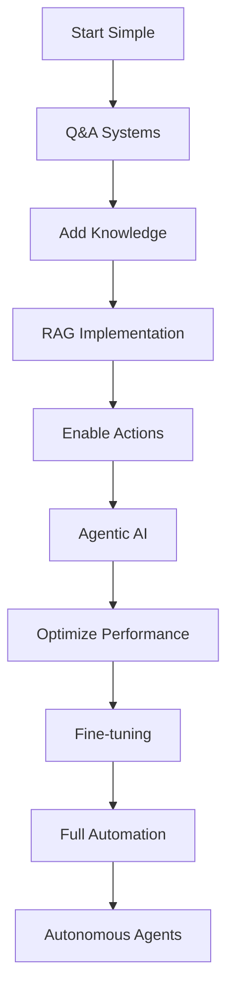

Before:

- Check all ports/demo/playgrounds are up and running
- ~Better word instead of *marketer* and update~
- Review and use better markdown elements as per slidev(do not over-engineer though)
- When possible(and if remembered), ask questions to make it more engaging. Like, Any users for * here?

---

Background:
Before moving on to next point, ask questions.
Before each point, explain what the active point lacks, and how the new point addresses that gap.


Glossary:
- The terms LLM and AI are used interchangeably. The only take away is, it meant a system that can think.

---

<!-- Invite: -->
I attempted to cover all topics of AI, and as non-technical as it gets, and mostly focusing on leveraging it.
Aspects as *

---

<!-- Disclaimer -->
While, I've tailored this session to be more of as non-technical as possible, making a point that it's for anyone. *

My analysis/opinion is entirely subjective. For this session(considering it's for everyone), I've focused on the point about building/using the systems that could be boiled down to a natural-language query and have the task completed.

This session is gonna be by me, so expect some remarks, lame-jokes, and at times, maybe some *complexity*(or *confusing*). In which case, feel free to <u>ask questions</u>. 

While ignorance is bliss, so is useful information. and thus my belief is: to question on everything, is how you can answer/understand anything.

And on that note, I'm gonna cover this session with answering such questions. We're gonna cover:
- the When, Now
- the What, When explaining the topics
- the Where, By covering use-cases
- the How, By showing the implementations
- and the Why and the Which, in the end.

<!-- Next Slide -->
- For someone wondering the question, Who? It's me, Srikanth V. And for the Whom, It's whoever is interested <emoji>

* Also, attempts of Dramatization to make it more engaging. Sorry in Advance. <emoji>
---

<!-- In MCP -->
Little things like: Typos, Grammar, Case-Sensitive, etc.
Bigger things like: Security, Accessibility, UI/UX, Bugs, SEO, Content, etc.


---

TODO:
- [ ] propel theme: colors
- [ ] consistent headings
- [ ] Placement of "check system-prompt leaks"
- [ ] cover insights/notes for MCP use-case
- [ ] Links to MCP Servers
- [ ] Limitations of MCP Servers

---

<!-- When discussing on the instructions -->
jailbreak
GDPR hacks (Data protection)

---

<!-- Before END: 1 -->
Limitations and Clarity:
~~Using LLMs in IDE like Cursor, Windsurf~~
- LLM is as good as the one who uses it.
- As one's understanding is not what's the requirement is, like developers, an AI also needs test-cases, context, documentation, etc.


<!-- Before END: 2 -->

I'm more of a backend engineer, I like to deal with complexity, performance, scalability, security, etc. And it's always been overlooked what a backend engineer does.

Like the joke goes,
> A backend engineer, a networking guy, and a janitor.
> If you don’t know their name, it means they’re doing their job perfectly.


The shift in AI, now allows us to change this. As, it's more of backend and not in the sense of code but in the sense of architecture and scaling, improving latency, controlling unpredictability, handling dynamic variables, foreseeing security issues. Allowing us to earn the term 'engineer' instead of a 'developer'.

Not that the frontend developers doesn't do much, we need someone to build chatbots. Wait a min, that is something designers do.

Just kidding, We also need someone to develop websites that are LLM friendly.

<!-- Before END: 3 -->


---


<!-- After the END  -->
For the most awaited question, which also might backfire to me is, Why?

<!-- new slide -->
- and the only answer I could think of is, Why Not?
- I mean, the future we always speak of is already the present, and before it's gonna be the past, let's explore on the *Which*.
- Which part of the functionality/process we can improve with AI.
- Which platforms, tools we can cover to have the AI implemented and thus

<!-- new slide -->
 **Leverage AI**.
By Simple Prompts

<!-- new slide -->
Like I've been mentioning to @Madhu & @Raj Sir earlier, it's probably the first time, where we're not lacking by the technology, but the use-case.


----
----

# Bin:


<div>

```typescript
// MCP Resource Example
const mcpConfig = {
  resources: ["database", "api_endpoints"],
  tools: ["email_sender", "calendar_api"],
  prompts: ["task_scheduler", "decision_maker"],
  context: "user_preferences"
}
```
</div>

---
---


---
layout: two-cols
---

# **Key Takeaways**

We've explored four powerful AI implementation patterns:

<div class="grid grid-cols-1 gap-4">

### **🤖 Q&A Systems**
Direct, structured interactions for specific tasks

### **🔍 RAG** 
Knowledge-enhanced responses from your data

### **🧠 Agentic AI**
Autonomous decision-making with system access

### **🎯 Fine-tuning**
Domain-specific expertise and accuracy

</div>

**Remember:** Choose the right pattern for your specific use case and requirements.

::right::

# **Implementation Strategy**



<div class="pt-4">

**Progressive Enhancement:**
- Start with basic Q&A
- Add knowledge bases (RAG)
- Enable system actions (Agentic)
- Optimize with custom training
- Scale to full automation

</div>
