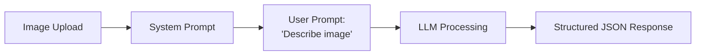
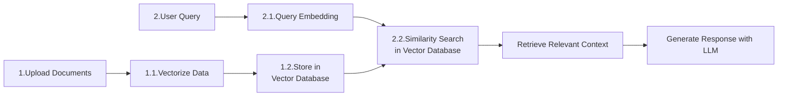
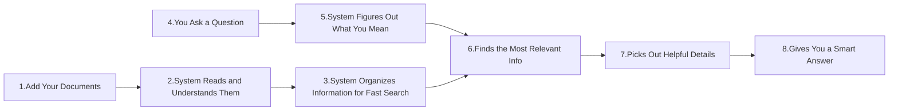
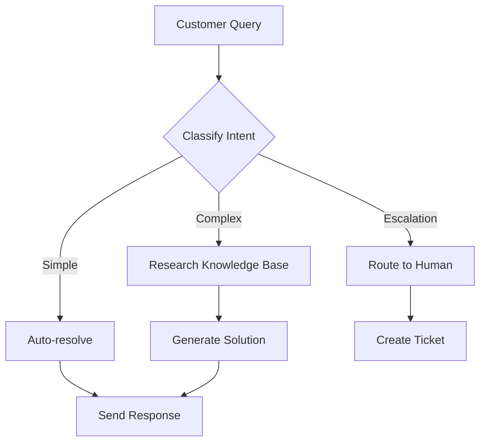

# **Leveraging AI** 
**Beyond, By Simple Prompts**

A deep dive into **contextual AI** (*as I'd like to call it* or *a lack of better word*)
<br> that understands <u>your data</u> and acts <u>autonomously</u>

<div class="absolute bottom-4 right-6 flex items-center justify-center">
  <a href="https://github.com/slidevjs/slidev" target="_blank" alt="GitHub"
    class="text-l slidev-icon-btn opacity-50 !border-none !hover:text-white">
    <carbon-logo-github />
  </a>
  <span class="italic text-sm opacity-70 ml-2">This slide is made by Slidev</span>
</div>

---
layout: default
---

# What We're Going to Explore Today?

<div class="grid grid-cols-1 gap-4">

**Leveraging AI** — not by the way we typically interact with AI like ChatGPT, DALL-E, Perplexity, or Copilot(in IDEs) that simply respond to prompts.

We're talking about **contextual AI**. An *extension* of AI that understands:
- Your documents, APIs, and systems  
- Your databases
- and communicate with any software/system autonomously

We'll explore few of the amazing and fascinating, if not a bit scary capabilities of this technology.
</div>

<div class="pt-12 flex justify-center">
  <span @click="$slidev.nav.next" class="px-2 py-1 rounded cursor-pointer" hover="bg-white bg-opacity-10">
    Ready for an adventure? <carbon:arrow-right class="inline"/>
  </span>
</div>

<style>
h1 {
  background-color: #2B90B6;
  background-image: linear-gradient(45deg, #4EC5D4 10%, #146b8c 20%);
  background-size: 100%;
  -webkit-background-clip: text;
  -moz-background-clip: text;
  -webkit-text-fill-color: transparent;
  -moz-text-fill-color: transparent;
}
</style>


---
layout: center
class: text-center
---

# So, what is AI?

---
layout: center
class: text-center
---

If that's the question, we're not going to answer it here.

---
layout: center
---

# **What else we're not going to cover?**
- Prompt Engineering
- AI for research, writing, etc. 
- Developing applications using prompts with AI
- How to effectively use AI tools

<!-- - How to build AI-powered applications -->
<!-- - Solutions to problems -->

<!-- 📚  ✍️ 🛠️💡  -->

<style>
h1 {
  background-color: #2B90B6;
  background-image: linear-gradient(45deg, #4EC5D4 10%, #146b8c 20%);
  background-size: 100%;
  -webkit-background-clip: text;
  -moz-background-clip: text;
  -webkit-text-fill-color: transparent;
  -moz-text-fill-color: transparent;
}
</style>
---
layout: center
class: text-center
---

# **So, What are we gonna cover?**
We'll explore some of the AI implementations that are out there today. 
<br>
<br>
*Implementations* that we can use to create our own <u>AI-powered solutions</u>, <u>Assistants</u>.
<br>
Not just flashy gimmicks, but one's that provide real-value to our/user specific needs.


<div class="pt-12 flex justify-center">
  <span @click="$slidev.nav.next" class="px-2 py-1 rounded cursor-pointer" hover="bg-white bg-opacity-10">
    Let's Begin! <carbon:arrow-right class="inline"/>
  </span>
</div>

---

# **AI Implementation Patterns**

Based on my experience/analysis, AI implementations in applications generally fall into one of these categories:

<div class="grid grid-cols-2 gap-8 pt-4">

<div>

## 🤖 **1. Q&A Systems**
Direct LLM Prompting <span class="text-xs" style="color: grey;">(ChatGPT, Claude, etc.)</span>  
 
## 🧠 **3. Agentic AI**  <span style="color: red;">*</span>
LLM + Model Context Protocol <span class="text-xs" style="color: grey;">(MCP)</span>

</div>
  
<div>

## 🔍 **2. RAG** 
Retrieval Augmented Generation <span class="text-xs" style="color: grey;">(Chatbots)</span>

## 🎯 **4. Fine-tuned LLMs**
Custom Training <span class="text-xs" style="color: grey;">(Domain-specific models)</span>

</div>

</div>

<div class="pt-6">

**Plus:** Autonomous AI Agents that orchestrate complex workflows. More on this in the end.

</div>

<br>

<span class="text-base" style="color: grey;"><span style="color: red;">*</span> More like what makes an AI *Agentic*.</span>

<!-- <arrow v-click="1" x1="200" y1="420" x2="230" y2="470" color="#564" width="3" arrowSize="1" /> -->

---
layout: center
class: text-center
---

# 1. Q&A Systems: Direct LLM Interaction
(The Foundation of AI Applications)

---
# layout: two-cols
---

# **1.1 What exactly it means?**

You provide a **system prompt** (*optional, but recommended*) attached to a payload (`images`, `JSON`, `text`, etc.) and send it to an LLM for structured responses (sometimes based on user-query).

**The Flow:**
- User provides input + system prompts <span class="text-xs" style="color: grey;">(optional)</span>
- LLM combines both prompts  
- Returns structured response

<br>

### What are System Prompts?
This is usually how ChatGPT, Claude and other LLM providers are instructed/regulated. These are used to guide the LLM's behavior and responses.

- Ever wondered how ChatGPT vibes with you? Yeah, it was [instructed](https://github.com/asgeirtj/system_prompts_leaks/blob/main/OpenAI/o4-mini.md#:~:text=Over%20the%20course%20of%20conversation%2C%20adapt%20to%20the%20user%E2%80%99s%20tone%20and%20preferences).
- Ever wondered how it *refuse requests* get political/controversial statements? Yeah, it was [regulated](https://github.com/asgeirtj/system_prompts_leaks/blob/main/Anthropic/claude-sonnet-4.md#:~:text=do%20not%20use%20these%20harmful%20sources%20and%20refuse%20requests).

You can find more of such system prompts from various leaks, like: [Source 1](https://github.com/jujumilk3/leaked-system-prompts), [Source 2](https://github.com/asgeirtj/system_prompts_leaks).
<br>

<style>
  h3 {
    font-size: 1.5rem;
    font-weight: 600;
    margin-bottom: 1rem;
    color: #2B90B6;
  }
</style>

---
layout: default
---

<br>

### **1.2 Real-World Use Case - Vision AI**



<div class="pt-0">

**Example:**
- **Payload:** Receipt image
- **System Prompt:** Expected JSON format with edge-cases handled
- **Response:** Expense data extraction

</div>


<div class="pt-8">

### **Key Challenge:** Prompt engineering and edge case handling

```yaml
// Example system prompt structure
Extract receipt data as JSON with fields: 
{date, vendor, amount, category, items[]}
Handle edge cases: logos, non-receipts, unclear text, mis-leading text that mimics receipts.
```

</div>

---
layout: default
---

## **1.2 Implementation in our Applications**

<br>

<div class="grid gap-10">

<div>

# <u>**Expense App Integration**</u>
System prompt  + image payload = structured JSON <br>
OpenAI/Gemini Vision API extracts structured JSON from receipt images based on *system prompts*

Links: [JIRA](https://propelapps.atlassian.net/browse/MOB2024AB-118?focusedCommentId=18561), [GitHub](https://github.com/sidharth74659/test-vertex-ai)

Playground/Demo: [Google AI Studio](https://aistudio.google.com/prompts/1mkNqSsRID6F3YfN1c9g2SXyYFjYbEDhr)

</div>

<div>

# <u>**Digital Forms Generation**</u>
User input + schema-based system prompt = schema based JSON
<br>
Natural language to structured form conversion

Links: [Website](https://digital-forms-builder.netlify.app/), [Repo](https://bitbucket.org/mobilesupplychain24c/poc/commits/fdd1bced599642edd85d90658978d5f7e2b9fe1e)

Demo: [Frontend - local](http://localhost:55056/), [Backend - local](http://localhost:3000)
</div>

<!-- Soon, We can improve this by offering 'Analyse' -->

<!-- Now, Let's have a reality check -->

</div>

---
layout: default
---

# **1.3 Edge Cases**

<div class="grid grid-cols-1 gap-4">

### **Testing and Validation:**
- ❌ Handle mismatched inputs (logo vs. receipt expectation).
- ❌ Posing irrelevant questions that do not align with the objective.
- ⚠️ Validate non-image uploads mimicking receipts.

### **Best thing**:
- It boils down to your system-prompt to handle all the above like we've seen earlier in leaks, and you can have an AI suggest you to do that (<span class="text-xs blink-smooth" style="color: orange;"><u>demonstrate</u></span>).
- The real work would be the test-cases and checks we need to do which is critical for production.
- Thus, We need to:
  - 🔄 Continuously refine prompts for edge cases.
  - 🧪 Build comprehensive test scenarios. <span class="text-xs" style="color: grey;">(For production)</span>

</div>

---
layout: center
# class: text-center
---


<span class="text-xl">But this seems to be more of an interaction between what seems like a *backend* and a *system*.</span>

<br>

> **How does this benefit us? As an end-user?**
<br>

It does, that's what one does with ChatGPT and other LLM providers. User asks a question and it returns a response.

<br>

> **But how are we gonna tailor it?**

YOU CAN, and it's there.
<br>

Each LLM provider has a different way of doing this.
- Perplexity calls it [Personalise](https://www.perplexity.ai/account/personalize),
- ChatGPT calls it 'Customize',
- Gemini refers it [saved-info](https://gemini.google.com/saved-info)


---
layout: center
---

Now the question just doesn't stay there, right?

- The laziness in the body might think, “Am I going to keep providing the same context every time I ask a question to every LLM?”

- The curious mind kicks in and might ask, “What about the information that LLM doesn’t know? Not just **my** preferences, but the project I’m working on? What if I want to research or chat with information that’s not on the internet, but stored in a set of documents — like manuals, reports, etc.?”

- The concerned one might wonder, “But what about my personal information or company information? I can’t put it on the internet, and I can’t share it with the LLM.”


---
layout: center
class: text-center
---

# 2. RAG: Retrieval Augmented Generation
(Chatbots)

---
# layout: two-cols
---

## **2.1 What is RAG?**

<span class="text-md" style="color: grey;">RAG enhances LLM accuracy by retrieving relevant information from your knowledge base before generating responses.</span>

**Key Difference:**
- **LLM:** Responds from training data  
- **RAG:** First retrieves relevant information, then generates responses <span class="text-xs" style="color: grey;">(on top of it)</span>

**Think of it as:** Giving your LLM a research library.

Also, you can always enable it to access the internet, to verify the information. But otherwise, it can work as an *offline* system once fed with the knowledge base.

**The Process:**




---
layout: default
---

<!-- But, didn't you said it was gonna be non-technical? -->

## **2.2 Components of RAG** <span class="text-base" style="color: grey;">(For someone technical)</span>

<br>

<div class="grid grid-cols-2 gap-6">

<div>

### **Document Processing**
1. **Chunk documents** into manageable pieces
2. **Convert to vectors** using embedding models
3. **Store in vector databases** (Pinecone, Weaviate, Chroma)

<br>

### **Query Processing**
4. **Transform user questions** into comparable vectors
5. **Find similar content** using cosine similarity
6. **Retrieve top-k matches** for context

</div>


<div>

<br>
<br>
<br>
<br>

## **Technical Stack**

```yaml
Vector Database: Pinecone/Weaviate
Embedding Model: OpenAI/Sentence-BERT
Chunking Strategy: Recursive text splitting
Similarity Metric: Cosine similarity
Response Model: GPT-4/Claude

Architecture:
- Document ingestion pipeline
- Real-time query processing
- Response caching for performance
```

<!-- **Status:** Ready for implementation with existing document storage infrastructure -->

</div>

<!-- 
<div>

### **Response Generation**
```python
# Simplified RAG pipeline
def rag_response(query):
    # 1. Embed query
    query_vector = embed_model.encode(query)
    
    # 2. Search similar documents
    similar_docs = vector_db.search(query_vector, top_k=5)
    
    # 3. Generate response with context
    context = "\n".join(similar_docs)
    response = llm.generate(f"Context: {context}\nQuery: {query}")
    
    return response
```

</div> -->

</div>

---
layout: default
---

**Non-Technical Translation:**



<br>

Going with our use-case,

```yaml
Step 1  : Upload Documents        - Add manuals, reports, personal info 👀, etc.
Step 1.1: Read Documents          - System scans and learns.
Step 1.2: Organize Information    - Sorts for quick access.
Step 2  : Ask a Question          - Type your query.
Step 3  : Understand Query        - System interprets your question.
Step 4  : Find Relevant Info      - Searches documents for answers.
Step 5  : Extract Details         - Gathers useful information.
Step 6  : Provide Answer          - Delivers a clear, helpful response.
```

<!-- 
**Non-Technical Translation:**
Turn documents into searchable formats → Find relevant matches → Generate informed answers
 -->

---
layout: default
---

## **2.3 RAG in our Applications** *

<br>
<br>

<div class="grid grid-cols-2 gap-6">

<div>

#### **Asset/Contractor Management** (Maintenance)
- Query inventory/security based on stored manuals and specs
- Troubleshooting guidance 
- Inquire about attached images (e.g., equipment photos)

</div>
<div>

#### **Knowledge Base Systems** (Inventory)
- Internal documentation search and response
- How-to procedure inquiries
- Training material Q&A

</div>

Demo: [Datastax - GUI](https://astra.datastax.com/langflow/6ad91a31-de2e-4fd6-bbe9-d1817b9771c3/flow/83904f2a-d0a2-4f66-a3ab-fefd3ceda44c), [By Jatin/Rajeev - Code](https://propelappscom.sharepoint.com/sites/Product/Shared%20Documents/Forms/AllItems.aspx?id=%2Fsites%2FProduct%2FShared%20Documents%2FGeneral%2FProduct%20Documentation%2F6%2E%20Project%20Management%2F1%2E%20Project%20Plan%2FGen%20AI%2F25B&viewid=124ba412%2Da235%2D413c%2D8bbf%2Dbd21b3a4e61d&p=true&ga=1)

</div>

<br><br>

<span style="color: grey;">
*Yet to be implemented — planned for Q3 2025. This will enable document-based chatbots and contextual search in our internal applications.
</span>

---
layout: intro
---

<span class="text-xl">But wait, this seems to be more of an interaction between a *user* and a *system*.</span>

<br>

> **How does this benefit us?**
<br>
<span class="text-base" style="color: grey;">As a developer, designer, business analyst, marketers and managers?</span>

<br>

YOU CAN, but free version is kind of limited. <span class="text-xs" style="color: grey;">(Ofcourse, based on provider)</span>

Few platforms are:
- Google's [NotebookLM](https://notebooklm.google.com/)
- Perplexity's [Spaces](https://www.perplexity.ai/spaces/templates) <span class="text-xs" style="color: grey;">(Perplexity Pro)</span>
- Microsoft Copilot <span class="text-xs" style="color: grey;">(with Copilot Pro or Copilot for Microsoft 365)</span>

---
layout: center
---

Like always, the question just doesn’t stay there, does it?

- Someone that's up-to-date/impatient might question, “We already know this. While this is enough for the *amazing* part of what AI can do, where does the so-called *fascinating, if not scary* part come in?”

- The lazy one might think, “So now I’m supposed to keep updating the knowledge base about myself/company/project as the information updates?”

- The curious might ask, “What if I want it to not only know information, but also interact with the tools I use — or even get some of my automated tasks done? I mean, clearly, if needed, it seems like it can search what it needs from the internet, if not from the knowledge base.”

- The concerned one might say, hmmm.. anything, but unfortunately, they’ll have to stay concerned for now, as the next point we’re going to cover isn’t production-ready yet—but there are workarounds.


---
layout: center
class: text-center
---

# **3. Agentic AI**
(kinda)

---
layout: full
---

## **3.1 What is Agentic AI?**

<span class="text-md" style="color: grey;">**Agentic AI** makes autonomous(*technically, partially guided*) decisions and takes actions based on available information(resources) and context(tools).</span>

Basically, you provide a 
- **Prompt** (like 'Build this component')
- It uses **Tools** (like Terminal, IDE)
- **Resources** (like commands, code)

Before someone's gonna say: *"I know this! That's what [claude-artifacts](https://madewithclaude.com/), [Bolt](https://bolt.new/), [Lovable](https://lovable.dev/), Copilot, Cursor and many more are doing"*. Remember? we're not gonna cover that here.

<br>

**While they are there, till how far can we reach? Like:**
- What happens when the codebase gets too large? or more than one developer needs to chip in?
- What do we do when it's a production issue? or the code starts spiraling beyond one's understanding?
- And who’s responsible for making sure that fixing one thing doesn’t break something else?


---
layout: default
---

Someone must have thought, "Well, We aren't there ***yet!***". Yeah, I know, but my point <span class="text-base" style="color: grey;">(or opinion)</span> is that LLM's are always better off as assistants, than as some autonomous developers.

I mean, I’d trust my [instinct over intellect](https://www.youtube.com/watch?v=qjPCjn8iVWs). - `Cillian Murphy`. Anyway, more on this at the end.

<br>

<hr>

<br>

**So, where was I? Uh... Assistant!** <span class="text-xs" style="color: grey;">(also, little history)</span>

For any assistant(LLM), it needs to know the task(prompt), the tools, and how to use them(resources).

OpenAI and Gemini offer what’s called **Function Calling**, while Anthropic refers to it as **Tool Use** or **Tool Calling** to achieve this. Different Names, Different Implementations, Same Concept. <span class="text-xs blink-smooth" style="color: orange;">[Samples](https://github.com/jujumilk3/leaked-system-prompts/blob/main/github-copilot-chat_20240930.md#functions) in [system-prompt](https://github.com/asgeirtj/system_prompts_leaks/blob/main/OpenAI/chatgpt-4.1-mini.md) [leaks](https://github.com/jujumilk3/leaked-system-prompts/blob/main/cursor-ide-agent-claude-sonnet-3.7_20250309.md)</span>

But none of these were standardized. Anthropic later proposed [**Model Context Protocol (MCP)**](https://modelcontextprotocol.io/introduction), and Google took this further with [**Agent-to-Agent (A2A)**](https://google-a2a.github.io/A2A/#a2a-and-mcp-complementary-protocols) Protocol.

These open standards are designed to unify how applications and systems provide context and tool access to LLMs, making the process more seamless and interoperable.

**Think of it as**: AI with decision-making abilities and standardized access to your tools.

---
layout: default
---

### **3.2 Understanding MCP and Function Calling** 

Going with our previous example: For any assistant(LLM), it needs to know what to do(prompt), tools it can use, and how to use(resources).

**MCP Components**:
- **Prompts:** What you ask or tell the assistant to do.
- **Tools:** Things the assistant can use, like calculators, search engines, or apps.
- **Resources:** Where the assistant can look for information, like databases or websites.
- **Context:** What’s already happened in the conversation, so it doesn’t forget.

<br>

**What does this make possible?**
- The assistant can do things directly, like look up info or run a search.
- It can handle tasks that take several steps, not just one.
- It can make smarter choices by knowing what tools and info it has.
- Multiple assistants or AIs can work together if needed.

<!-- 
### **Different Names, Same Concept:**

<div class="grid grid-cols-3 gap-4">

<div class="p-2 mb-2 border rounded">

### **Anthropic**
Model Context Protocol (MCP)
- Standardized context sharing
- Resource-aware interactions

</div>

<div class="p-2 mb-2 border rounded">

### **OpenAI/Google**
Function Calling
- Direct API integration
- Tool usage capabilities

</div>

<div class="p-2 mb-2 border rounded">

### **Google A2A**
Agent-to-agent interaction
- Multi-agent coordination
- Complex workflow orchestration

</div>

</div> 
-->

---
layout: default
---

### **3.3 Implementation in our Applications**

<br>

#### **Smart Scheduling System (Planned):**

**Capabilities:**
- 🗣️ Natural language resource queries
- 📅 Automated task scheduling based on availability  
- 💡 Context-aware responses
<!-- - 🔄 Multi-system coordination -->

Links: - [JIRA - with much detailed explanation](https://propelapps.atlassian.net/browse/MSC24C-157?focusedCommentId=23137)

Demo: [Scheduler - Frontend](http://localhost:55267/scheduler), [Scheduler - Backend](http://localhost:3333/)

<br>

#### **Example Interaction:**
```yaml
User: "Schedule a team meeting for next week, avoid conflicts with John's vacation"
Agent: Checks calendar → Identifies available slots → Considers team preferences → Books meeting → 
       Sends invitations
```

---


<div>

### **Web Automation/Testing**
- **Puppeteer/Playwright** for web interactions
- **Selenium** for complex browser automation

Demo: [UI/UX Review Report](https://bitbucket.org/mobilesupplychain24c/digital-forms/src/demo--ai-testing/guides/ui-ux-evaluation-report.md)

Branch: `testing-with-puppeteer`, `ai-testing` (for reports), `json-viewer` (for developming through testing)

<br>

### **Design Integration**
- **Figma MCP** for design workflows

<br>

### **Open Source Ecosystem** (No Demos)
- **Database connectors** (Supabase, SQL, NoSQL, ERP Systems, etc.)
- **Communication tools** (email, Slack, Teams, etc.)
- **File processing** (PDF, Excel, etc.)

</div>

---
layout: center
class: text-center
---

# **4. Fine-tuned LLMs: Custom Training**
(Tailored AI for Specific Use Cases)

---
layout: two-cols
---

# **4.1 What is Fine-tuning?**

Train models with your specific dataset — documents, images, conversation patterns.

**Similar to Machine Learning** but using LLM as the foundation instead of building from scratch.

**When to Use:** Highly specialized tasks requiring domain-specific expertise

::right::

# **Examples**

<div class="grid grid-cols-1 gap-4">

### **🔧 Damage Detection**
Analyze maintenance images for specific issues
- Custom image recognition
- Maintenance-specific terminology
- Historical repair patterns

### **👤 Personality Cloning**
Replicate communication patterns from chat history
- Writing style adaptation
- Response pattern matching
- Context-aware persona

### **📋 Response Standardization** 
Ensure consistent answer formats
- Brand voice consistency
- Technical accuracy
- Compliance requirements

</div>

---
layout: default
---

# **4.2 Fine-tuning Implementation**

<div class="grid grid-cols-2 gap-6">

<div>

## **Training Process**

```python
# Fine-tuning pipeline example
def fine_tune_model():
    # 1. Prepare dataset
    training_data = load_domain_specific_data()
    
    # 2. Preprocess and format
    formatted_data = format_for_training(training_data)
    
    # 3. Fine-tune base model
    model = fine_tune(
        base_model="gpt-3.5-turbo",
        training_data=formatted_data,
        epochs=3,
        learning_rate=0.0001
    )
    
    # 4. Evaluate performance
    evaluate_model(model, test_data)
    
    return model
```

</div>

<div>

## **Use Cases in Our Apps**

### **Maintenance System**
- Equipment-specific damage recognition
- Predictive maintenance recommendations
- Work order classification

### **Customer Service**
- Domain-specific response generation
- Escalation pattern recognition
- Sentiment analysis tuned for our users

### **Data Processing**
- Custom extraction patterns
- Business logic implementation
- Quality assurance automation

**ROI:** Higher accuracy for specialized tasks vs. general-purpose models

</div>

</div>

---
layout: center
class: text-center
---

# **5. Orchestrated Workflows**
(Autonomous AI Agents)

---
layout: default
---

### **5.1 Workflow Automation Platforms:**

<div class="grid grid-cols-3 gap-2">

<div class="p-2 border rounded">

<u>**LangChain**</u>
#### AI Application Framework
- Chain complex AI operations
- Memory management
- Tool integration
- Python/JavaScript support
<!-- 
```python
# LangChain agent
from langchain.agents import create_agent
agent = create_agent(
    tools=[database_tool, email_tool],
    llm=ChatOpenAI(),
    memory=ConversationBufferMemory()
)
```
-->

</div>

<div class="p-2 border rounded">

<u>**N8N**</u>
#### Visual Workflow Automation
- Drag-and-drop interface
- 400+ integrations
- Self-hosted or cloud
- Custom node development
<!-- 
```javascript
// N8N workflow example
{
  "trigger": "webhook",
  "actions": [
    "process_data",
    "ai_analysis", 
    "send_results"
  ]
}
```
 -->
**Perfect for:** Non-technical team members to build AI workflows

</div>

<div class="p-2 border rounded">

<u>**Flowise**</u>
#### Low-code AI Workflows
- Visual flow builder
- LangChain integration
- Chat interface
- Custom components

**Perfect for:** Non-technical team members to build AI workflows

</div>

</div>

## **Capabilities:**
- 🔄 **Continuous task execution** - 24/7 automation
- 🔗 **Multi-system integration** - Connect disparate tools
- 🌳 **Complex decision trees** - Conditional logic flows
- 📊 **Automated reporting** - Insights and analytics

---
layout: default
---

# **5.2 Autonomous Agent Examples**

<div class="grid grid-cols-2 gap-6">

<div>

## **Customer Support Agent**



**Capabilities:**
- Intent classification
- Knowledge base search
- Escalation logic
- Response generation

</div>

<div>

## **Maintenance Scheduler**

### **End-to-end Process:**
1. **Monitor** equipment sensors
2. **Predict** maintenance needs
3. **Check** technician availability  
4. **Schedule** optimal time slots
5. **Order** required parts
6. **Send** notifications
7. **Update** tracking systems

### **Benefits:**
- Reduced downtime
- Optimized resource allocation
- Proactive maintenance
- Automated documentation

</div>

</div>

---
layout: center
class: text-center
---

# ⚠️ What Could Go Wrong?

---
layout: default
---

# **The Reality of AI Implementation**

<div class="grid grid-cols-2 gap-6">

<div>

### **Common Risks**

#### **🤖 Hallucination Risk**
- AI can generate plausible-sounding but incorrect information

#### **🔍 Misinterpretation**
- Instructions taken too literally
- Context misunderstood
- Edge cases not handled

#### **🛡️ Security Concerns**
- Prompt injection attacks
- Data leakage risks
- Unauthorized access attempts

</div>

<div>

### **Mitigation Strategies**

#### **🧪 Comprehensive Testing**
<!-- 
```python
def validate_ai_response(response, context):
    checks = [
        verify_factual_accuracy(response),
        check_context_relevance(response, context),
        validate_safety_constraints(response),
        test_edge_cases(response)
    ]
    return all(checks)
```
 -->

#### **🔒 Security Measures**
- Input validation and sanitization
- Output content filtering
- Access control and monitoring
- Regular security audits

#### **👥 Human Oversight**
- Review critical decisions
- Escalation protocols
- Performance monitoring
- Continuous improvement loops

</div>

</div>
<!-- 
<div class="pt-6 text-center">

**Stay smart, stay aware of what you're building**

</div> -->

---
layout: center
class: text-center
---

# Thank You!

## Questions and Discussion Time

<div class="pt-12">
  <span class="px-2 py-1 rounded cursor-pointer" hover="bg-white bg-opacity-10">
    Let's explore your AI implementation questions! 🚀
  </span>
</div>

<div class="abs-br m-6 flex gap-2">
  <button @click="$slidev.nav.go(1)" class="text-xl slidev-icon-btn opacity-50 !border-none !hover:text-white">
    <carbon:arrow-left />
  </button>
</div>

---
# layout: end
---

# Resources & Next Steps

<div class="grid grid-cols-2 gap-6">

<div>

## **Getting Started**
- **OpenAI API** - Q&A and Vision AI
- **Anthropic Claude** - Advanced reasoning
- **LangChain** - AI application framework
- **Pinecone** - Vector database for RAG

## **Open Source Tools**
- **Ollama** - Local LLM deployment
- **ChromaDB** - Open source vector DB
- **Flowise** - Visual AI workflow builder
- **N8N** - Workflow automation

</div>

<div>

## **Implementation Roadmap**
1. Start with simple Q&A systems
2. Build knowledge base (RAG)
3. Add system integrations (Agentic)
4. Scale with fine-tuning
5. Deploy autonomous workflows

## **Best Practices**
- Always validate AI outputs
- Implement proper error handling  
- Plan for edge cases
- Monitor performance continuously
- Keep humans in the loop for critical decisions

</div>

</div>


